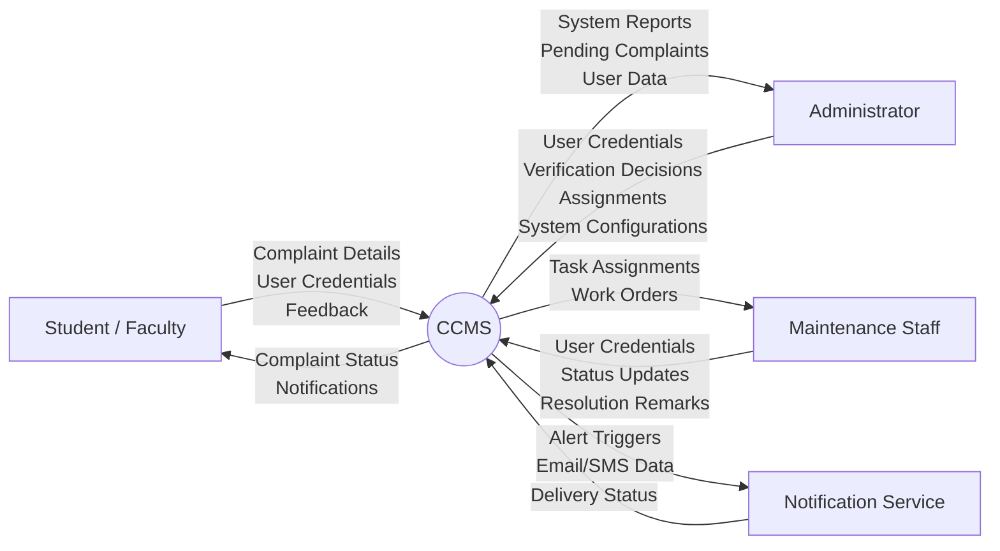
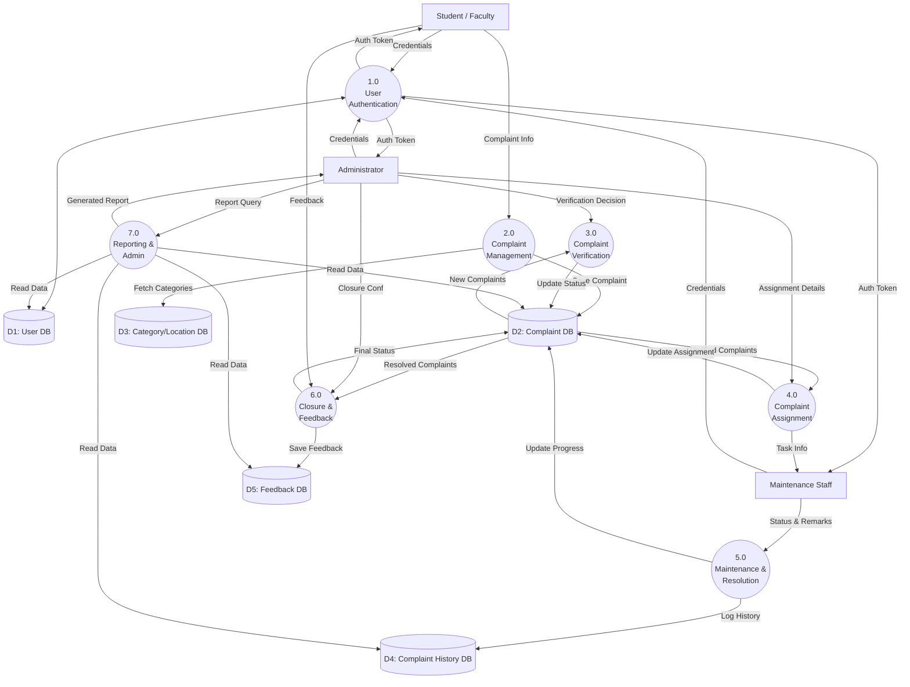
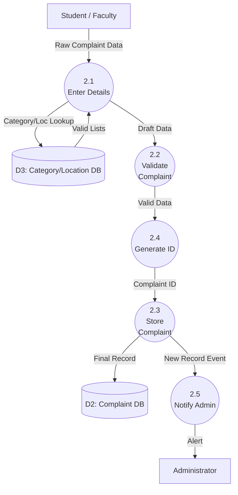
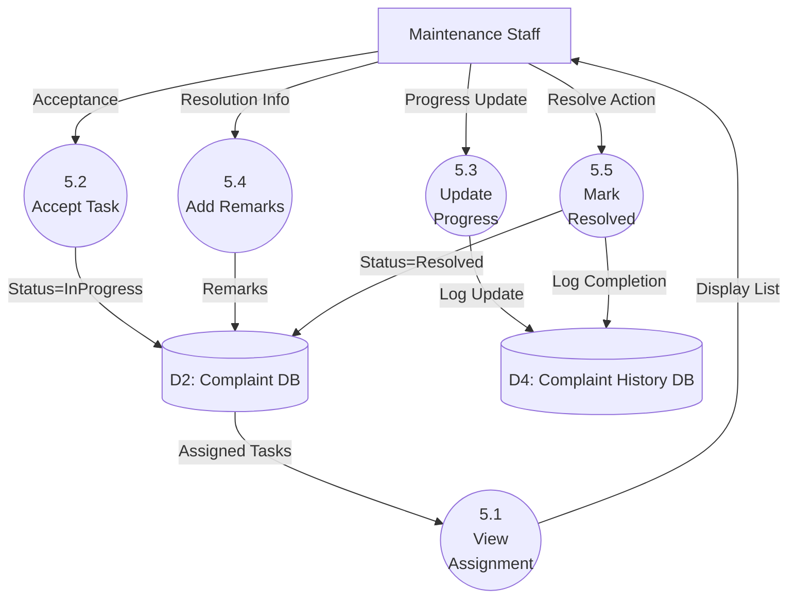

# Data Flow Diagrams (DFD)

## 1. Context Level DFD (Level 0 Overview)

## 2. Level 0 DFD

## 3. Level 1 DFD - Decomposition of 2.0 Complaint Management

## 4. Level 1 DFD - Decomposition of 5.0 Maintenance & Resolution

## DFD Balancing Notes
The DFDs are perfectly balanced. The inputs and outputs in the Context Diagram exactly match the net inputs and outputs traversing the boundaries of the Level 0 diagram. Furthermore, when decomposing Process 2.0 and Process 5.0 into Level 1, the external data flows entering and leaving those subprocesses correspond to those in Level 0.
