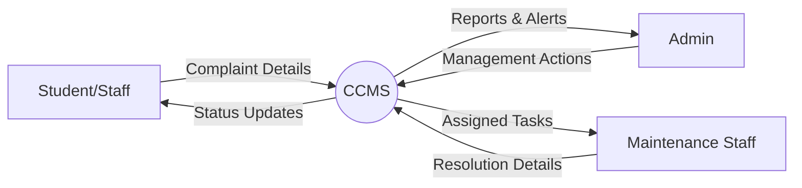
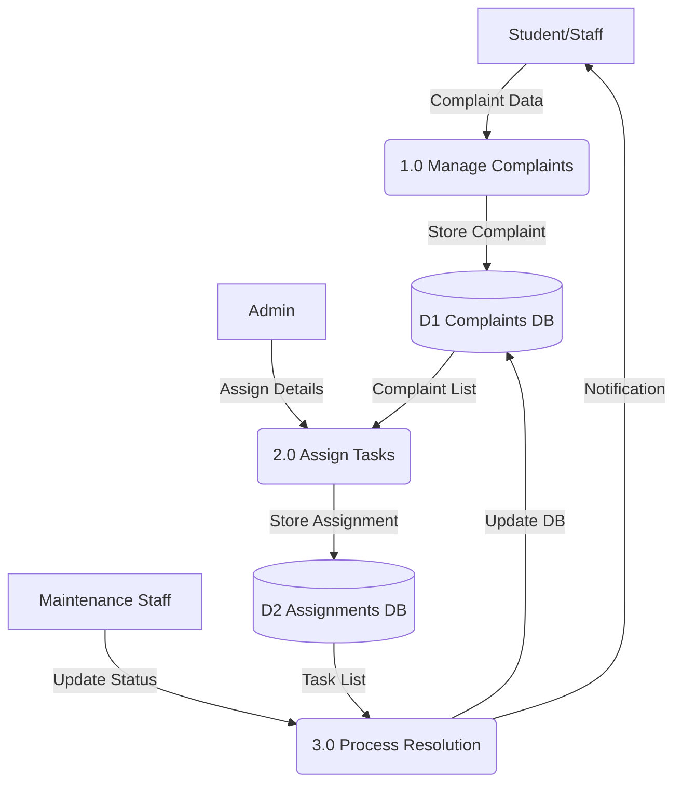

# Experiment No: 1
## Title: Data Flow Diagrams for CCMS

**Course Code:** 23CS4219 | **Course:** Software Engineering Lab

### 1. Aim
To create Context Level, Level-0, and Level-1 Data Flow Diagrams (DFDs) for the Campus Complaint & Maintenance Management System (CCMS).

### 2. Objective
Represent data flows, processes, data stores, and external entities in the CCMS.

### 3. Problem Statement
The campus currently handles maintenance complaints manually, leading to lost requests, delayed resolution, and lack of accountability. A structured data flow is required to understand how information should move through the proposed automated system.

### 4. Theory
A Data Flow Diagram (DFD) maps out the flow of information for any process or system. It uses defined symbols like rectangles, circles and arrows to show data inputs, outputs, storage points and the routes between each destination. 
- **Process:** Transforms incoming data flow into outgoing data flow (Circle or Rounded Rectangle).
- **Data Store:** Repositories of data in the system (Parallel lines).
- **External Entity:** Outside system that sends or receives data (Rectangle).
- **Data Flow:** Movement of data (Arrow).

**DFD Leveling:**
- **Context Diagram (Level 0):** Shows system as a single process interacting with external entities.
- **Level-0 DFD (Level 1):** Breaks down the main process into major subsystems.
- **Level-1 DFD (Level 2):** Further details the subsystems.

### 5. Procedure
1. Identify all external entities (Student/Staff, Admin, Maintenance Staff).
2. Identify main inputs and outputs.
3. Draw Context Diagram.
4. Identify major processes and data stores.
5. Draw Level-0 DFD.
6. Refine Level-0 processes to Level-1 DFDs.

### 6. Diagrams

#### Context Diagram

#### Level-0 DFD

### 7. Result
The Context Level and Level-0 Data Flow Diagrams for the Campus Complaint & Maintenance Management System have been successfully created and analyzed.
