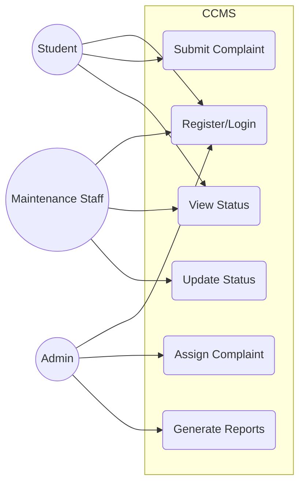

# Experiment No: 2
## Title: Use Case Diagram for CCMS

**Course Code:** 23CS4219 | **Course:** Software Engineering Lab

### 1. Aim
To identify actors and use cases for the Campus Complaint & Maintenance Management System (CCMS).

### 2. Objective
Model the functional requirements using UML use cases to show interactions between actors and the system.

### 3. Theory
A Use Case Diagram shows the functional model of a system, detailing the interactions between users (actors) and the system.
- **Actor:** Represents a role played by a user or another system interacting with the subject.
- **Use Case:** A specific functionality or goal the system provides.
- **Include:** A use case that is strictly required by another.
- **Extend:** A use case that adds optional functionality to another.

### 4. Procedure
1. Identify system boundaries.
2. Identify actors interacting with the system.
3. Identify the main use cases for each actor.
4. Establish relationships (include, extend).
5. Draw the UML diagram.

### 5. Diagram

### 6. Use Case Scenarios
- **UC-01 (Register/Login):** Actors authenticate to access system features.
- **UC-02 (Submit Complaint):** Students/Staff lodge new maintenance issues with details like category and location.
- **UC-03 (View Status):** Users track the progress of their submitted complaints.
- **UC-04 (Assign Complaint):** Admin reviews open complaints and assigns them to relevant maintenance staff.
- **UC-05 (Update Status):** Maintenance staff update the task as 'In Progress' or 'Resolved'.
- **UC-06 (Generate Reports):** Admin generates statistical reports on complaint resolution times and categories.

### 7. Result
The Use Case diagram for the Campus Complaint & Maintenance Management System was successfully created, identifying all primary actors and their interactions.
