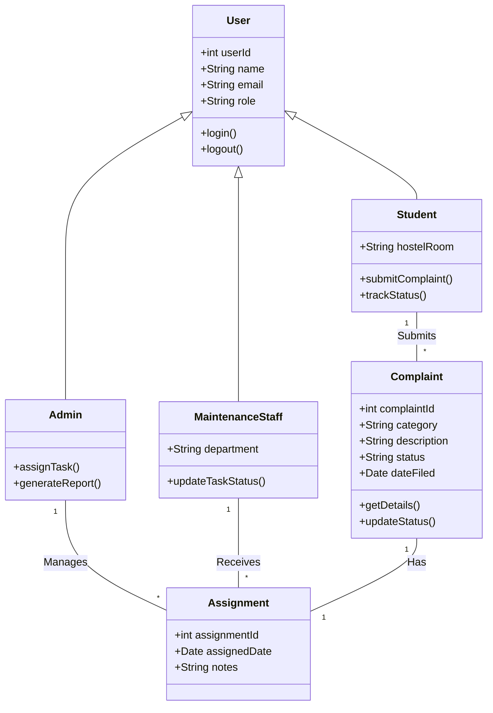

# Experiment No: 3
## Title: Class Diagram for CCMS

**Course Code:** 23CS4219 | **Course:** Software Engineering Lab

### 1. Aim
To model the object-oriented structure of the Campus Complaint & Maintenance Management System (CCMS).

### 2. Objective
Identify classes, attributes, methods, and their relationships (association, aggregation, composition, inheritance).

### 3. Theory
A Class Diagram is a static structure diagram that describes the structure of a system by showing its classes, their attributes, operations (or methods), and the relationships among objects.
- **Classes:** Represent entities with common characteristics.
- **Attributes:** Properties of a class.
- **Methods:** Operations a class can perform.
- **Relationships:** Association (general link), Aggregation (weak whole-part), Composition (strong whole-part), Inheritance/Generalization (parent-child).

### 4. Procedure
1. Identify nouns from the problem statement to form classes.
2. Identify attributes for each class.
3. Identify methods/operations.
4. Establish relationships and multiplicity between classes.
5. Draw the class diagram.

### 5. Diagram

### 6. Explanation
- **User Class:** Base class representing any system user.
- **Student, Admin, MaintenanceStaff:** Inherit from User, representing specific actor roles.
- **Complaint Class:** Represents the core entity with status and details.
- **Assignment Class:** Represents the linking entity when a complaint is assigned to staff.

### 7. Result
The structural Class Diagram for the CCMS was successfully modeled and analyzed, defining key entities and their OOP relationships.
