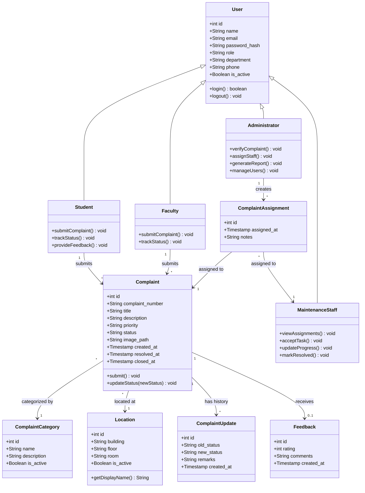

# Experiment No: 3
## Title: Class Diagram for CCMS

**Course Code:** 23CS4219 | **Course:** Software Engineering Lab

### 1. Aim
To model the object-oriented structure of the Campus Complaint & Maintenance Management System (CCMS).

### 2. Objective
Identify classes, attributes, methods, and their relationships (association, aggregation, composition, inheritance).

### 3. Theory
A Class Diagram is a static structure diagram that describes the structure of a system by showing its classes, their attributes, operations (or methods), and the relationships among objects.
- **Classes:** Represent entities with common characteristics.
- **Attributes:** Properties of a class.
- **Methods:** Operations a class can perform.
- **Relationships:** Association (general link), Aggregation (weak whole-part), Composition (strong whole-part), Inheritance/Generalization (parent-child).

### 4. Procedure
1. Identify nouns from the problem statement to form classes.
2. Identify attributes for each class.
3. Identify methods/operations.
4. Establish relationships and multiplicity between classes.
5. Draw the class diagram.

### 5. Diagram

### 6. Explanation

| Class | Role | Maps to DB Table |
|-------|------|-----------------|
| **User** | Base class for all actors; stores credentials | `users` |
| **Student / Faculty** | Submitters of complaints (extends User) | `users` (role='STUDENT'/'FACULTY') |
| **Administrator** | Manages all complaints, assigns, generates reports | `users` (role='ADMIN') |
| **MaintenanceStaff** | Receives tasks, updates progress | `users` (role='MAINTENANCE') |
| **Complaint** | Core entity with lifecycle status | `complaints` |
| **ComplaintCategory** | Classifies complaint type | `complaint_categories` |
| **Location** | Physical campus location | `locations` |
| **ComplaintAssignment** | Links complaint to maintenance staff | `complaint_assignments` |
| **ComplaintUpdate** | Audit trail of all status changes | `complaint_updates` |
| **Feedback** | User rating after resolution | `feedback` |

**Key Relationships:**
- **Inheritance:** Student, Faculty, Administrator, MaintenanceStaff all extend User.
- **Association:** A Student/Faculty submits many Complaints; each Complaint belongs to one User.
- **Dependency:** Each Complaint has one Category and one Location.
- **Aggregation:** An Administrator creates ComplaintAssignments; a MaintenanceStaff receives them.
- **Composition:** A Complaint owns its ComplaintUpdates (deletes cascade).
- **Association:** A Complaint optionally has one Feedback entry.

### 7. Result
The structural Class Diagram for the CCMS was successfully modeled with **10 classes**, **4 inheritance relationships**, and **6 association/composition relationships**, all consistent with the implemented database schema and backend controllers.

