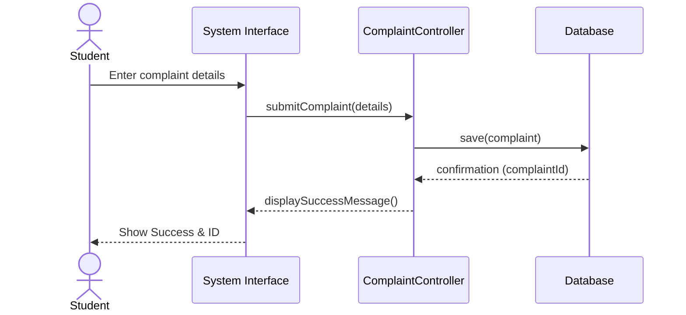
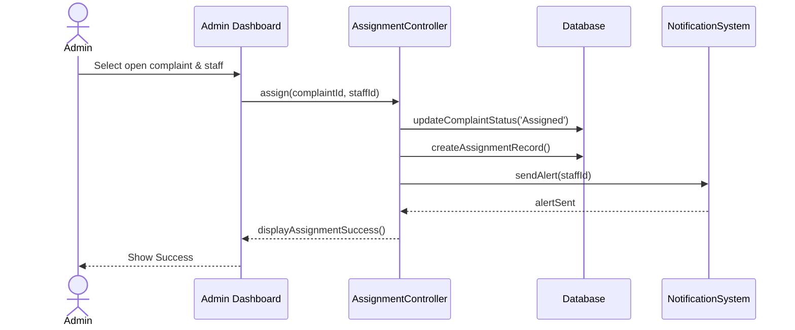
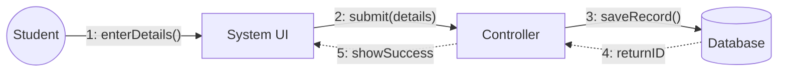

# Experiment No: 4
## Title: Interaction Diagrams for CCMS

**Course Code:** 23CS4219 | **Course:** Software Engineering Lab

### 1. Aim
To model dynamic interactions within the Campus Complaint & Maintenance Management System (CCMS).

### 2. Objective
Show object interactions for key scenarios using Sequence and Collaboration (Communication) diagrams.

### 3. Theory
Interaction diagrams model the dynamic behavior of a system.
- **Sequence Diagram:** Shows how objects interact in a particular time sequence. It includes lifelines, activation bars, and messages.
- **Collaboration Diagram:** Shows interactions organized around the objects and their links to one another, numbering messages to show sequence.

### 4. Procedure
1. Select a key use case (e.g., Submit Complaint, Assign Complaint).
2. Identify participating objects/lifelines.
3. Determine the sequence of messages passed.
4. Draw sequence and collaboration diagrams.

### 5. Diagrams

#### Sequence Diagram: Submit Complaint

#### Sequence Diagram: Assign Complaint

#### Communication Diagram: Complaint Submission (Logical Flow)

### 6. Result
Dynamic interactions for key CCMS functionalities were successfully modeled using Sequence and Collaboration diagrams.
