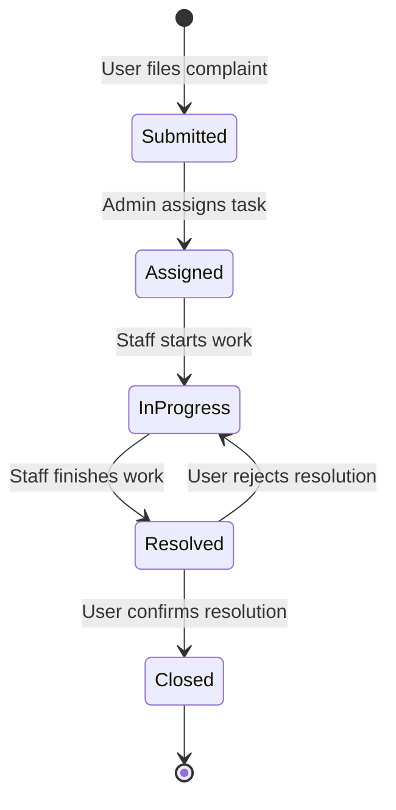

# Experiment No: 5
## Title: State Chart Diagram for CCMS

**Course Code:** 23CS4219 | **Course:** Software Engineering Lab

### 1. Aim
To model the lifecycle states of a complaint in the Campus Complaint & Maintenance Management System (CCMS).

### 2. Objective
Show all valid states, transitions, events, and conditions (guards) a complaint undergoes from submission to closure.

### 3. Theory
A State Chart Diagram models the dynamic behavior of a single object (or entity) throughout its lifetime. 
- **State:** A condition during the life of an object.
- **Transition:** A relationship between two states indicating an object will enter a new state.
- **Event:** A trigger that causes a transition.
- **Guard Condition:** A boolean expression that must be true for a transition to occur.

### 4. Procedure
1. Identify the core entity with a rich lifecycle (e.g., Complaint).
2. List all possible states for the entity.
3. Identify events that trigger state changes.
4. Identify any guard conditions.
5. Draw the state chart diagram.

### 5. Diagram

### 6. State & Transition Details

| Current State | Event | Next State | Guard Condition |
|---------------|-------|------------|-----------------|
| Initial | User clicks Submit | Submitted | Valid details |
| Submitted | Admin assigns staff | Assigned | Staff available |
| Assigned | Staff accepts task | InProgress | |
| InProgress | Staff marks fixed | Resolved | |
| Resolved | User accepts fix | Closed | `UserAccepted == True` |
| Resolved | User rejects fix | InProgress | `UserAccepted == False` |

### 7. Result
The lifecycle of a complaint was successfully modeled using a State Chart Diagram, clearly defining the system's states and transitions.
