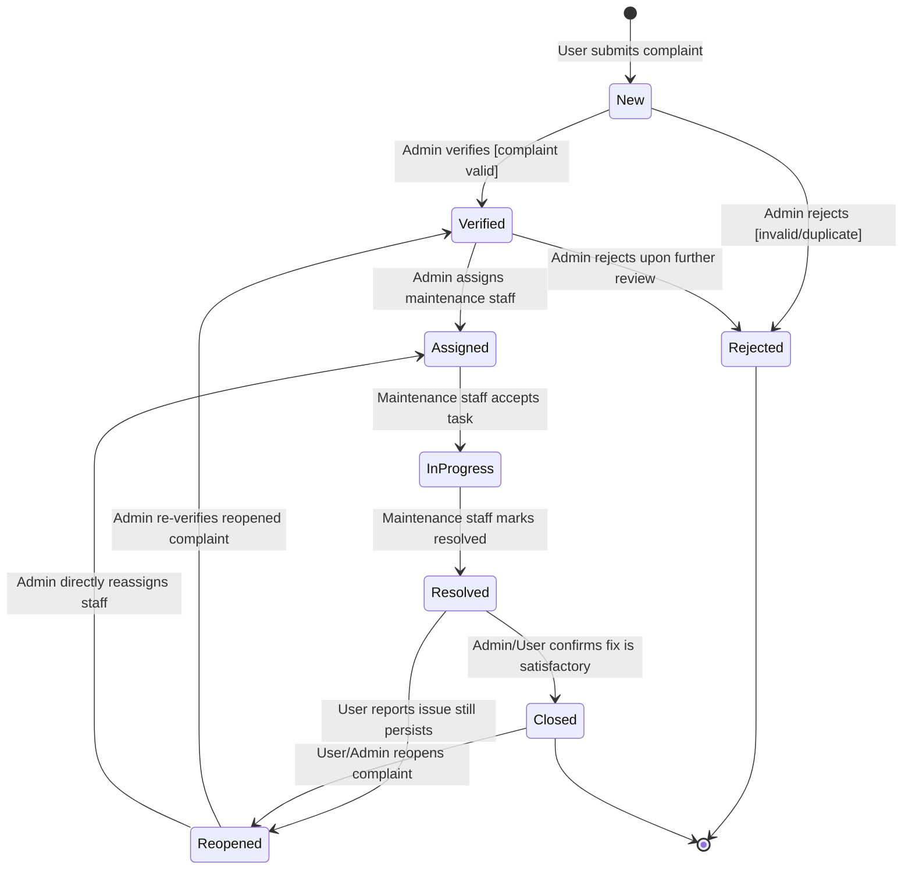

# Experiment No: 5
## Title: State Chart Diagram for CCMS

**Course Code:** 23CS4219 | **Course:** Software Engineering Lab

---

### 1. Aim
To model the complete lifecycle states of a complaint in the Campus Complaint & Maintenance Management System (CCMS).

### 2. Objective
Show all valid states, transitions, events, and guard conditions a complaint undergoes from submission to closure, including rejection and reopening paths.

### 3. Theory
A **State Chart Diagram** (UML Statechart) models the dynamic behavior of an object throughout its lifetime.

- **State:** A condition during the life of an object (e.g., NEW, VERIFIED, ASSIGNED).
- **Transition:** A directed relationship between two states, indicating the object moves from one state to another.
- **Event:** A trigger that causes a state transition (e.g., admin verifies, staff marks resolved).
- **Guard Condition:** A boolean expression that must be true for a transition to fire (e.g., `[complaint is valid]`).
- **Initial State:** Represented by a filled black circle `●`.
- **Final State:** Represented by a bull's-eye `◎`.

The state chart is useful for:
- Enforcing business rules about complaint lifecycle
- Preventing invalid state transitions in software
- Communication between developers and stakeholders

### 4. Procedure
1. Identify the core entity with a rich lifecycle: **Complaint**.
2. List all possible states from requirements analysis.
3. Identify events and actors that trigger each transition.
4. Add guard conditions where applicable.
5. Identify terminal states (CLOSED, REJECTED).
6. Add reopening path for business continuity.
7. Validate against the implemented state machine in `statusController.js`.

### 5. Diagram



### 6. State & Transition Details

| Current State | Event | Next State | Actor | Guard Condition |
|---------------|-------|------------|-------|----------------|
| [Initial] | User submits complaint | **New** | Student/Faculty | Form filled with valid data |
| New | Admin verifies | **Verified** | Administrator | Complaint is genuine and valid |
| New | Admin rejects | **Rejected** | Administrator | Complaint is invalid, duplicate, or OOS |
| Verified | Admin assigns staff | **Assigned** | Administrator | Maintenance staff available |
| Verified | Admin rejects | **Rejected** | Administrator | Complaint found invalid on review |
| Assigned | Staff accepts | **In_Progress** | Maintenance Staff | Staff is assigned to this complaint |
| In_Progress | Staff fixes issue | **Resolved** | Maintenance Staff | Issue physically resolved |
| Resolved | User/Admin confirms | **Closed** | Admin/Student/Faculty | Fix is satisfactory |
| Resolved | User rejects fix | **Reopened** | Student/Faculty | Issue still persists |
| Closed | User/Admin reopens | **Reopened** | Student/Faculty/Admin | Issue reappeared |
| Reopened | Admin re-verifies | **Verified** | Administrator | — |
| Reopened | Admin reassigns | **Assigned** | Administrator | Staff available |
| Rejected | — | [Final] | — | Terminal state |
| Closed | — | [Final] | — | Terminal state (unless reopened) |

### 7. Implementation Mapping

The state machine is enforced server-side in [`statusController.js`](../../backend/src/controllers/statusController.js):

```javascript
const VALID_TRANSITIONS = {
  'NEW':         ['VERIFIED', 'REJECTED'],
  'VERIFIED':    ['ASSIGNED', 'REJECTED'],
  'ASSIGNED':    ['IN_PROGRESS'],
  'IN_PROGRESS': ['RESOLVED'],
  'RESOLVED':    ['CLOSED', 'REOPENED'],
  'CLOSED':      ['REOPENED'],
  'REJECTED':    [],
  'REOPENED':    ['VERIFIED', 'ASSIGNED']
};
```

**Database ENUM** (schema.sql):
```sql
status ENUM('NEW','VERIFIED','ASSIGNED','IN_PROGRESS','RESOLVED','CLOSED','REJECTED','REOPENED')
```

All 8 states in the diagram exactly match the database ENUM and the server-side `VALID_TRANSITIONS` map.

### 8. Result
The complaint lifecycle was successfully modeled using a State Chart Diagram with **8 states** and **12 valid transitions**, correctly reflecting the implemented system behavior including the rejection and reopening paths.
