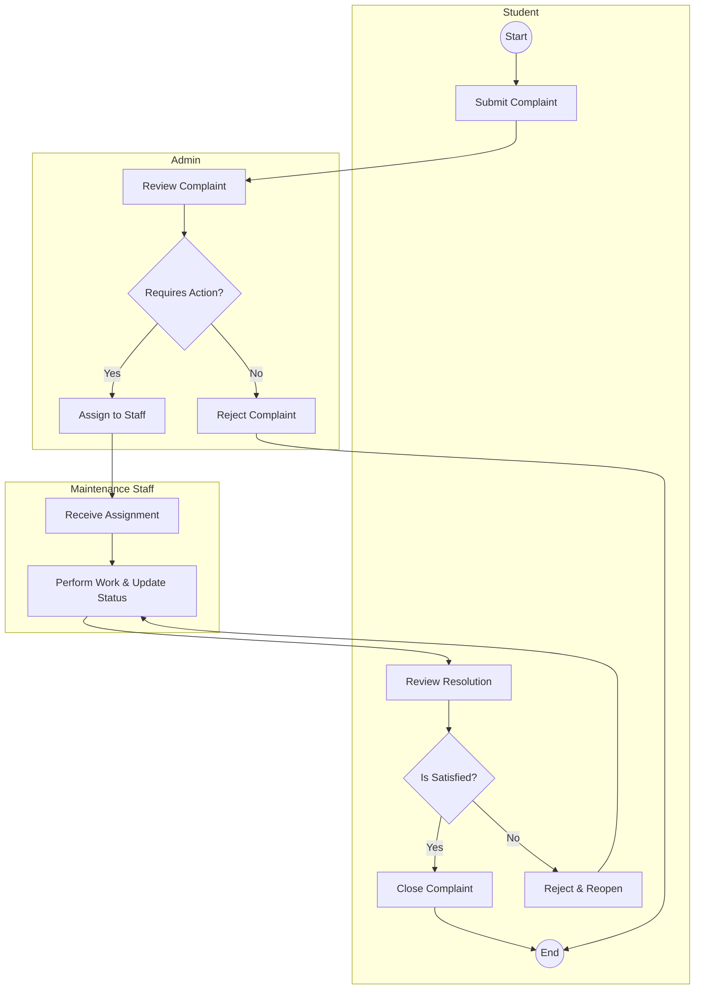

# Experiment No: 6
## Title: Activity Diagram for CCMS

**Course Code:** 23CS4219 | **Course:** Software Engineering Lab

### 1. Aim
To model the complete workflow of a complaint in the Campus Complaint & Maintenance Management System (CCMS).

### 2. Objective
Show the flow of activities, decision points, and concurrency from complaint submission to closure using swimlanes.

### 3. Theory
An Activity Diagram represents the workflow of stepwise activities and actions, with support for choice, iteration, and concurrency. 
- **Swimlanes:** Partition the diagram into responsibilities of different actors.
- **Action Nodes:** Represent executable steps.
- **Decision Nodes:** Represent branching based on conditions (Diamond shape).
- **Fork/Join:** Represent concurrent execution of threads.

### 4. Procedure
1. Identify actors involved in the workflow (Student, Admin, Maintenance Staff).
2. Trace the step-by-step process of handling a complaint.
3. Identify decision points (e.g., Is staff available? Is issue fixed?).
4. Draw the diagram using swimlanes.

### 5. Diagram

### 6. Result
The Activity Diagram successfully models the step-by-step workflow of the complaint resolution process across different actor swimlanes.
