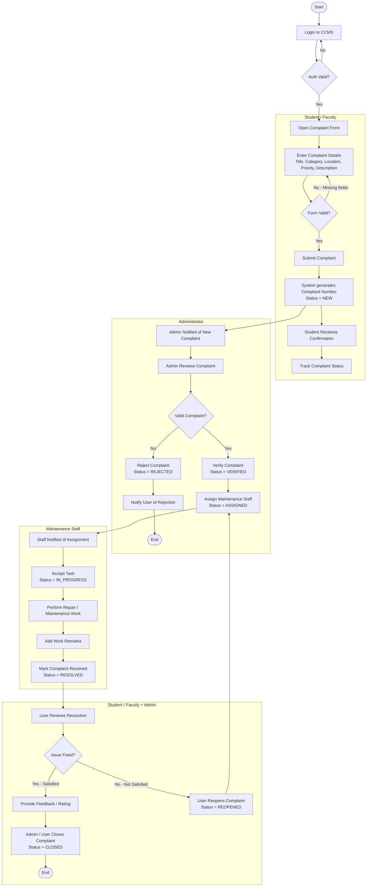

# Experiment No: 6
## Title: Activity Diagram for CCMS

**Course Code:** 23CS4219 | **Course:** Software Engineering Lab

---

### 1. Aim
To model the complete complaint handling workflow of the Campus Complaint & Maintenance Management System (CCMS) using an Activity Diagram with swimlanes.

### 2. Objective
Show the flow of activities, decision points, and all actors' responsibilities from login through complaint submission, verification, assignment, resolution, and closure — including the rejection and reopening paths.

### 3. Theory
An **Activity Diagram** (UML 2.x) represents the workflow of stepwise activities and actions, with support for choice, iteration, and concurrency.

- **Swimlanes (Partitions):** Divide the diagram into horizontal or vertical bands, each owned by an actor (Student/Faculty, Administrator, Maintenance Staff).
- **Action Nodes:** Rounded rectangles representing executable steps.
- **Decision Nodes:** Diamonds (`◇`) with outgoing guarded edges.
- **Initial Node:** Filled black circle `●`.
- **Activity Final Node:** Bull's-eye `◎`.
- **Fork/Join bars:** Show parallel/concurrent flows.

Activity diagrams are used to model business processes and workflows. This diagram maps directly to the implemented complaint lifecycle enforced in the backend's `statusController.js`.

### 4. Procedure
1. Identify all actors: **Student/Faculty**, **Administrator**, **Maintenance Staff**.
2. Trace the complete lifecycle from login to complaint closure.
3. Mark all decision points (Valid complaint? Approved? Issue fixed? Satisfied?).
4. Add the rejection path (Admin → Reject → Notify User → End).
5. Add the reopening path (User not satisfied → Reopen → Assign again).
6. Validate each path against the backend state machine.
7. Partition into swimlanes per actor.

### 5. Activity Diagram

> **Swimlane Description:**
> - **Left lane:** Student / Faculty actions
> - **Middle lane:** Administrator actions
> - **Right lane:** Maintenance Staff actions

### 6. Swimlane Responsibility Summary

| Actor | Key Activities |
|-------|---------------|
| **Student / Faculty** | Login, fill complaint form, submit, track status, review resolution, provide feedback, reopen if unsatisfied |
| **Administrator** | Review new complaints, verify/reject, assign to maintenance staff, close resolved complaints |
| **Maintenance Staff** | Receive assignment notification, accept task, perform work, add remarks, mark resolved |

### 7. Decision Points

| Decision | Condition (Yes) | Condition (No) |
|----------|----------------|----------------|
| Auth Valid? | Proceed to Dashboard | Re-enter credentials |
| Form Valid? | Submit complaint | Show validation errors |
| Valid Complaint? | Verify → Assign | Reject → Notify |
| Issue Fixed? | Submit feedback → Close | Reopen → Reassign |

### 8. Correspondence with State Machine

| Activity Step | Complaint Status Set |
|---------------|---------------------|
| Submit Complaint | `NEW` |
| Verify Complaint | `VERIFIED` |
| Reject Complaint | `REJECTED` |
| Assign Maintenance Staff | `ASSIGNED` |
| Accept Task | `IN_PROGRESS` |
| Mark Resolved | `RESOLVED` |
| Close Complaint | `CLOSED` |
| Reopen Complaint | `REOPENED` |

### 9. Result
The Activity Diagram successfully models the complete step-by-step workflow of the campus complaint resolution process across three swimlanes, covering all 8 complaint states and 4 decision points.
