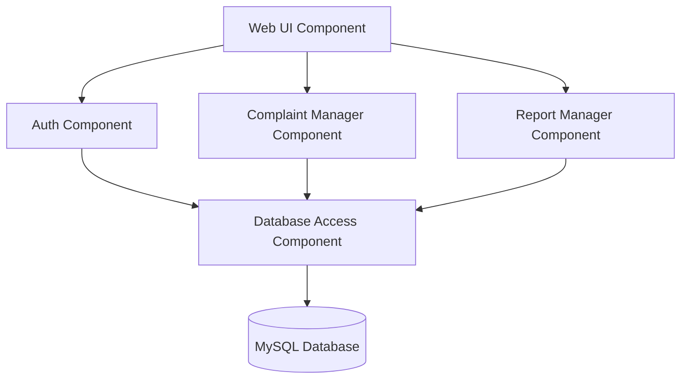
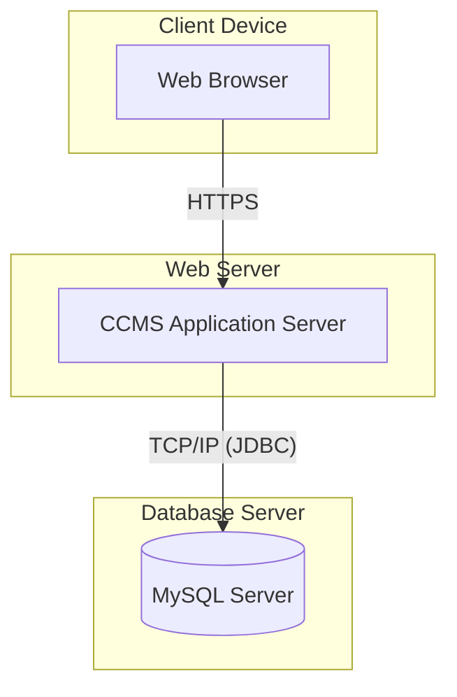

# Experiment No: 7
## Title: Component and Deployment Diagrams for CCMS

**Course Code:** 23CS4219 | **Course:** Software Engineering Lab

### 1. Aim
To model software components and the physical deployment architecture for CCMS.

### 2. Objective
Show component dependencies and how these components are mapped to physical hardware nodes.

### 3. Theory
- **Component Diagram:** Shows the structural relationships between software components (modules, libraries, APIs).
- **Deployment Diagram:** Shows the physical deployment of software on hardware nodes (servers, devices).

### 4. Procedure
1. Identify major software modules (UI, Business Logic, Database).
2. Draw the Component Diagram showing dependencies.
3. Identify physical hardware (Client PC, Web Server, DB Server).
4. Draw the Deployment Diagram mapping components to nodes.

### 5. Diagrams

#### Component Diagram

#### Deployment Diagram

### 6. Result
The software architecture and physical deployment topology for CCMS were successfully documented.
