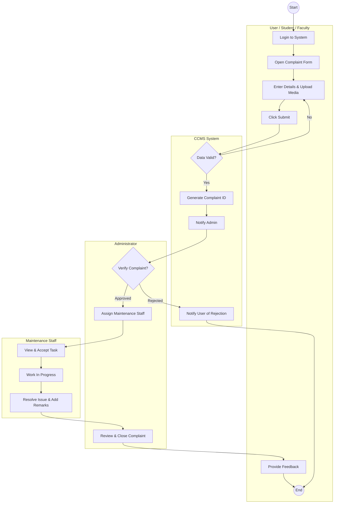

# Activity Diagram

## Complete Complaint Workflow

```mermaid
flowchart TD
    %% Start
    Start((Start)) --> Login

    %% Swimlane 1: User
    subgraph User [User / Student / Faculty]
        Login[Login to System] --> OpenForm[Open Complaint Form]
        OpenForm --> EnterDetails[Enter Details & Upload Media]
        EnterDetails --> Submit[Click Submit]
        
        ProvideFeedback[Provide Feedback] --> EndUser((End))
    end

    %% Swimlane 2: System
    subgraph System [CCMS System]
        Validate{Data Valid?}
        GenerateID[Generate Complaint ID]
        NotifyAdmin[Notify Admin]
        NotifyUserEnd[Notify User of Rejection]
    end

    %% Flow into System
    Submit --> Validate
    Validate -- No --> EnterDetails
    Validate -- Yes --> GenerateID
    GenerateID --> NotifyAdmin

    %% Swimlane 3: Admin
    subgraph Admin [Administrator]
        AdminVerify{Verify Complaint?}
        AssignStaff[Assign Maintenance Staff]
        AdminClose[Review & Close Complaint]
    end

    NotifyAdmin --> AdminVerify
    AdminVerify -- Rejected --> NotifyUserEnd
    NotifyUserEnd --> EndUser
    
    AdminVerify -- Approved --> AssignStaff

    %% Swimlane 4: Maintenance Staff
    subgraph Staff [Maintenance Staff]
        StaffAccepts[View & Accept Task]
        WIP[Work In Progress]
        Resolve[Resolve Issue & Add Remarks]
    end

    AssignStaff --> StaffAccepts
    StaffAccepts --> WIP
    WIP --> Resolve
    
    Resolve --> AdminClose
    AdminClose --> ProvideFeedback
```
