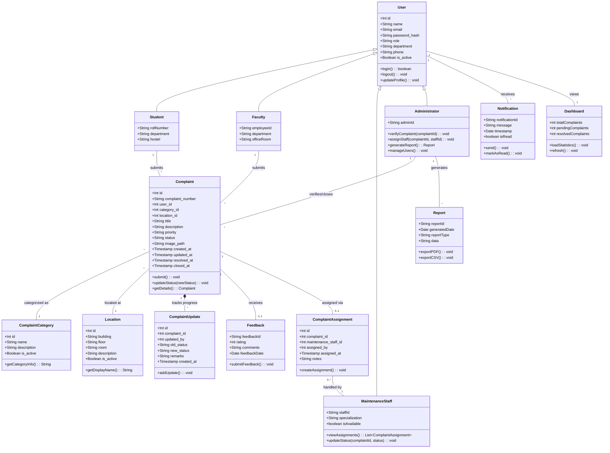

# Class Diagram

## Mermaid Class Diagram

## Detailed Explanation of Classes

1. **User (Abstract/Base Class)**: Represents the base entity for all actors in the system. Contains common attributes like name, email, and authentication methods.
2. **Student**: Inherits from User. Represents a student submitting complaints, contains specific fields like roll number.
3. **Faculty**: Inherits from User. Represents teaching staff, contains employee ID and office details.
4. **MaintenanceStaff**: Inherits from User. Represents the workers who resolve complaints. Has a specialization (e.g., plumbing, electrical).
5. **Administrator**: Inherits from User. Handles system oversight, complaint verification, assignment, and report generation.
6. **Complaint**: The core business entity. Contains all details regarding an issue raised by a Student/Faculty.
7. **ComplaintCategory**: Defines the classification of the complaint (e.g., Electrical, IT, Civil) for better routing.
8. **Location**: Specifies where the issue is occurring (building, room).
9. **ComplaintAssignment**: An associative entity representing the allocation of a specific complaint to a specific maintenance staff member.
10. **ComplaintUpdate**: Records the history and progression of a complaint's status over time.
11. **Feedback**: Stores user ratings and comments after a complaint is resolved and closed.
12. **Notification**: System alerts sent to users regarding status changes or new assignments.
13. **Dashboard**: Represents the UI aggregation of data showing statistics for a specific user role.
14. **Report**: An entity representing aggregated data exports generated by the Administrator.
