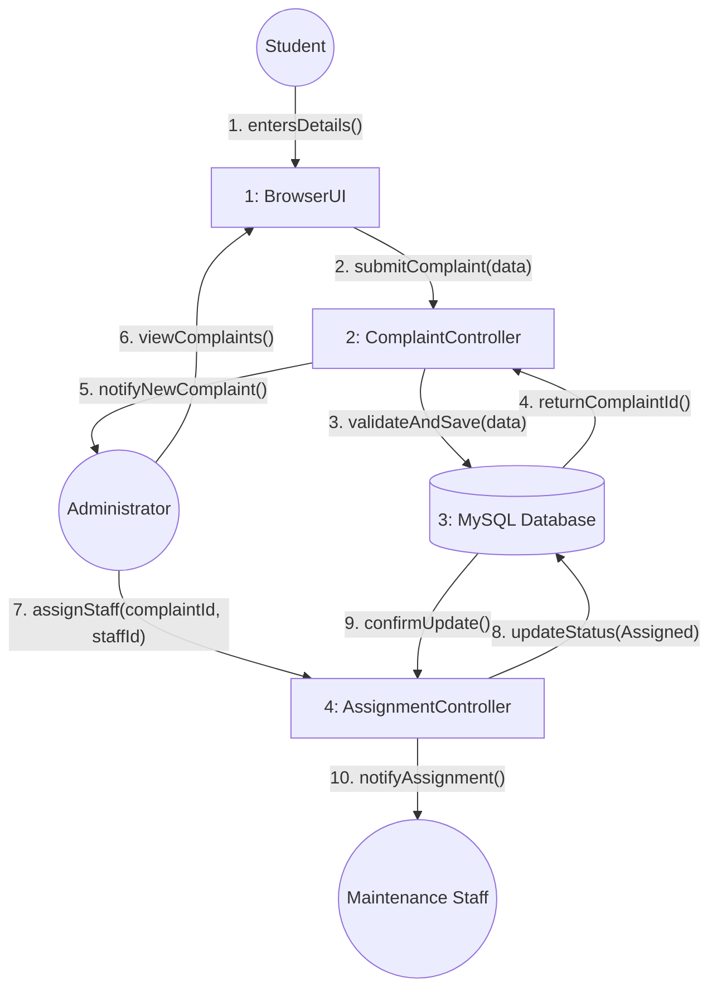

# Communication Diagram

## Complaint Submission & Assignment

**Description:**
This communication diagram (rendered as a directed graph) illustrates the collaboration between objects during the core workflow of a student submitting a complaint, which is then verified and assigned by the administrator to a maintenance staff member. Messages are numbered in the order of execution.
