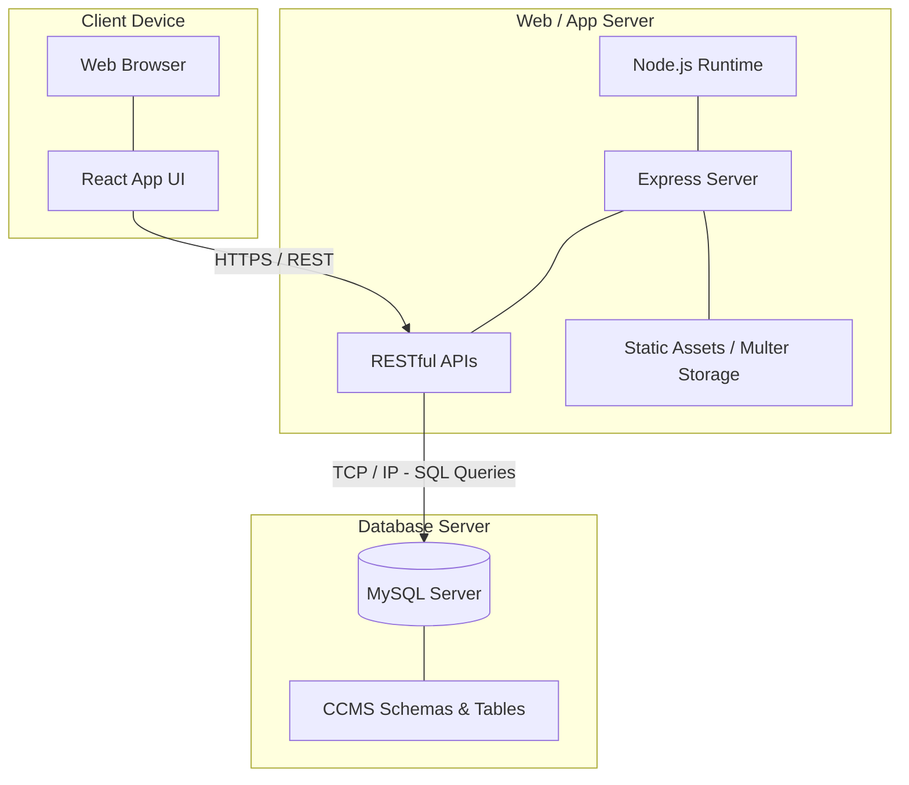

# Deployment Diagram

## CCMS Infrastructure

```mermaid
flowchart TD
    %% Nodes
    subgraph ClientNode [Client Device]
        Browser[Web Browser]
        React[React App UI]
        Browser --- React
    end

    subgraph AppServerNode [Web / App Server]
        Node[Node.js Runtime]
        Express[Express Server]
        API[RESTful APIs]
        Static[Static Assets / Multer Storage]
        Node --- Express
        Express --- API
        Express --- Static
    end

    subgraph DBServerNode [Database Server]
        MySQLDB[(MySQL Server)]
        Schemas[CCMS Schemas & Tables]
        MySQLDB --- Schemas
    end

    %% Connections
    React -->|HTTPS / REST| API
    API -->|TCP / IP - SQL Queries| MySQLDB
```
