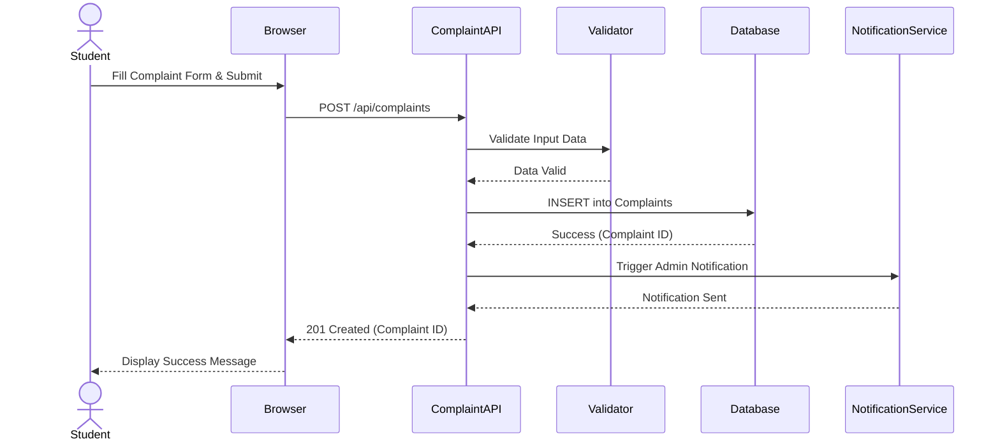
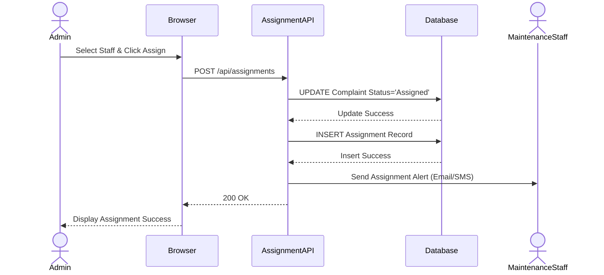
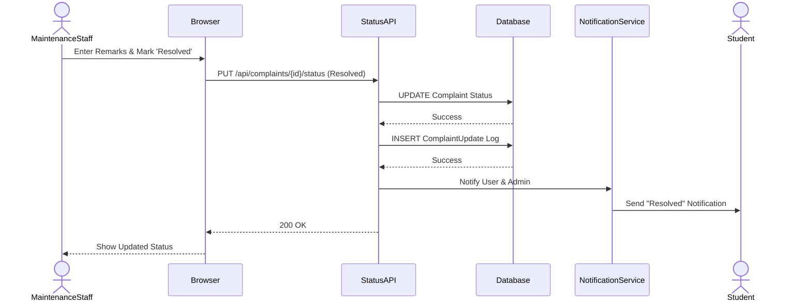
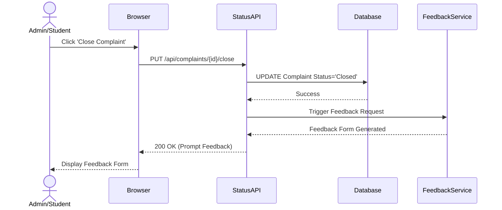

# Sequence Diagrams

## 1. Submit Complaint

```mermaid
sequenceDiagram
    actor Student
    participant Browser
    participant ComplaintAPI
    participant Validator
    participant Database
    participant NotificationService

    Student->>Browser: Fill Complaint Form & Submit
    Browser->>ComplaintAPI: POST /api/complaints
    ComplaintAPI->>Validator: Validate Input Data
    Validator-->>ComplaintAPI: Data Valid
    ComplaintAPI->>Database: INSERT into Complaints
    Database-->>ComplaintAPI: Success (Complaint ID)
    ComplaintAPI->>NotificationService: Trigger Admin Notification
    NotificationService-->>ComplaintAPI: Notification Sent
    ComplaintAPI-->>Browser: 201 Created (Complaint ID)
    Browser-->>Student: Display Success Message
```

## 2. Assign Complaint

```mermaid
sequenceDiagram
    actor Admin
    participant Browser
    participant AssignmentAPI
    participant Database
    actor MaintenanceStaff

    Admin->>Browser: Select Staff & Click Assign
    Browser->>AssignmentAPI: POST /api/assignments
    AssignmentAPI->>Database: UPDATE Complaint Status='Assigned'
    Database-->>AssignmentAPI: Update Success
    AssignmentAPI->>Database: INSERT Assignment Record
    Database-->>AssignmentAPI: Insert Success
    AssignmentAPI->>MaintenanceStaff: Send Assignment Alert (Email/SMS)
    AssignmentAPI-->>Browser: 200 OK
    Browser-->>Admin: Display Assignment Success
```

## 3. Resolve Complaint

```mermaid
sequenceDiagram
    actor MaintenanceStaff
    participant Browser
    participant StatusAPI
    participant Database
    participant NotificationService
    actor Student

    MaintenanceStaff->>Browser: Enter Remarks & Mark 'Resolved'
    Browser->>StatusAPI: PUT /api/complaints/{id}/status (Resolved)
    StatusAPI->>Database: UPDATE Complaint Status
    Database-->>StatusAPI: Success
    StatusAPI->>Database: INSERT ComplaintUpdate Log
    Database-->>StatusAPI: Success
    StatusAPI->>NotificationService: Notify User & Admin
    NotificationService->>Student: Send "Resolved" Notification
    StatusAPI-->>Browser: 200 OK
    Browser-->>MaintenanceStaff: Show Updated Status
```

## 4. Close Complaint

```mermaid
sequenceDiagram
    actor Admin_Student as Admin/Student
    participant Browser
    participant StatusAPI
    participant Database
    participant FeedbackService

    Admin_Student->>Browser: Click 'Close Complaint'
    Browser->>StatusAPI: PUT /api/complaints/{id}/close
    StatusAPI->>Database: UPDATE Complaint Status='Closed'
    Database-->>StatusAPI: Success
    StatusAPI->>FeedbackService: Trigger Feedback Request
    FeedbackService-->>StatusAPI: Feedback Form Generated
    StatusAPI-->>Browser: 200 OK (Prompt Feedback)
    Browser-->>Admin_Student: Display Feedback Form
```
