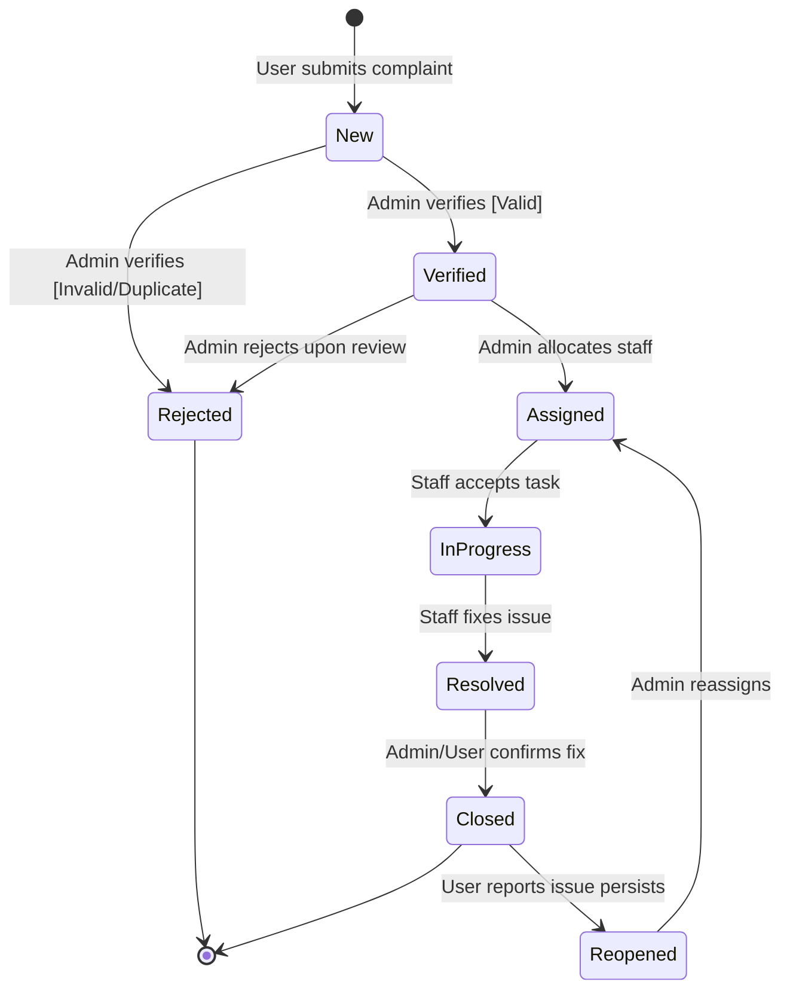

# State Machine Diagram

## Complaint Lifecycle

```mermaid
stateDiagram-v2
    [*] --> New : User submits complaint
    
    New --> Verified : Admin verifies [Valid]
    New --> Rejected : Admin verifies [Invalid/Duplicate]
    
    Verified --> Rejected : Admin rejects upon review
    Verified --> Assigned : Admin allocates staff
    
    Assigned --> InProgress : Staff accepts task
    
    InProgress --> Resolved : Staff fixes issue
    
    Resolved --> Closed : Admin/User confirms fix
    
    Closed --> Reopened : User reports issue persists
    Reopened --> Assigned : Admin reassigns
    
    Rejected --> [*]
    Closed --> [*]
```
