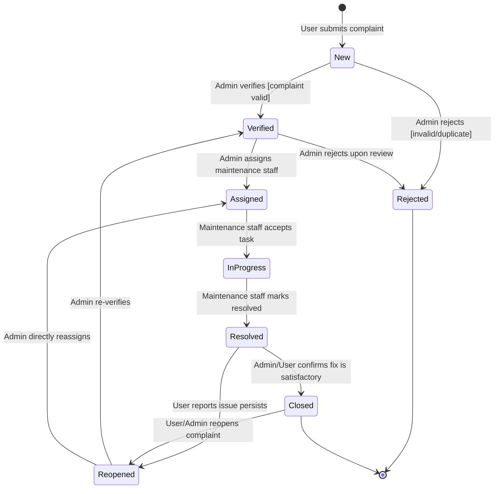

# State Chart Diagram — Complaint Lifecycle

**Experiment 5 Reference Document**  
**System:** Campus Complaint & Maintenance Management System (CCMS)

---

## State Diagram (Mermaid)



---

## State Descriptions

| State | Description | Actor Responsible |
|-------|-------------|-------------------|
| **New** | Complaint has been submitted and awaits admin review | System (automatic on submit) |
| **Verified** | Admin has confirmed the complaint is valid | Administrator |
| **Assigned** | Complaint has been assigned to a maintenance staff member | Administrator |
| **In_Progress** | Maintenance staff has accepted the task and is working on it | Maintenance Staff |
| **Resolved** | Maintenance staff has fixed the issue and marked it resolved | Maintenance Staff |
| **Closed** | Admin or user has confirmed the issue is resolved; complaint is archived | Administrator / Student / Faculty |
| **Rejected** | Complaint was deemed invalid, duplicate, or out of scope | Administrator |
| **Reopened** | Issue persists after resolution; complaint re-enters the workflow | Student / Faculty / Administrator |

---

## State Transition Table

| Current State | Event | Guard Condition | Next State | Actor |
|---------------|-------|----------------|------------|-------|
| New | Admin reviews | Complaint is valid | Verified | Admin |
| New | Admin reviews | Invalid/duplicate | Rejected | Admin |
| Verified | Admin assigns | Staff available | Assigned | Admin |
| Verified | Admin reviews further | Invalid | Rejected | Admin |
| Assigned | Staff accepts task | — | In_Progress | Maintenance Staff |
| In_Progress | Staff fixes issue | Issue resolved | Resolved | Maintenance Staff |
| Resolved | Admin/User approves | Fix is satisfactory | Closed | Admin/Student/Faculty |
| Resolved | User reports | Issue still present | Reopened | Student/Faculty |
| Closed | User/Admin reopens | Issue reappeared | Reopened | Student/Faculty/Admin |
| Reopened | Admin re-verifies | — | Verified | Admin |
| Reopened | Admin reassigns | — | Assigned | Admin |
| Rejected | — | Terminal state | — | — |
| Closed | — | Terminal state (unless reopened) | — | — |

---

## Implementation Reference

The state machine is enforced in [`statusController.js`](../../backend/src/controllers/statusController.js):

```javascript
const VALID_TRANSITIONS = {
  'NEW':         ['VERIFIED', 'REJECTED'],
  'VERIFIED':    ['ASSIGNED', 'REJECTED'],
  'ASSIGNED':    ['IN_PROGRESS'],
  'IN_PROGRESS': ['RESOLVED'],
  'RESOLVED':    ['CLOSED', 'REOPENED'],
  'CLOSED':      ['REOPENED'],
  'REJECTED':    [],
  'REOPENED':    ['VERIFIED', 'ASSIGNED']
};
```

Any attempt to make an invalid transition (e.g., NEW → CLOSED) returns HTTP 400 with an error message.

Role-based transition permissions:
- **ADMIN**: VERIFIED, REJECTED, ASSIGNED, CLOSED, REOPENED
- **MAINTENANCE**: IN_PROGRESS, RESOLVED
- **STUDENT/FACULTY**: REOPENED (own complaints only)

---

## Database Status Values

The `complaints.status` column is an ENUM:
```sql
ENUM('NEW','VERIFIED','ASSIGNED','IN_PROGRESS','RESOLVED','CLOSED','REJECTED','REOPENED')
```

This exactly matches the 8 states in the state diagram above.
