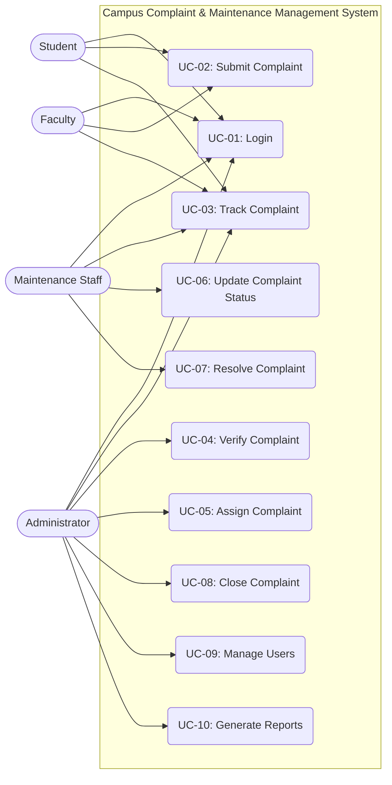

# Use Case Diagram and Scenarios

## Use Case Diagram

## Use Case Scenarios

### UC-01: Login
- **Actor:** All Users (Student, Faculty, Maintenance Staff, Administrator)
- **Preconditions:** User has a registered account in the system.
- **Main Flow:**
  1. User accesses the login page.
  2. User enters credentials (username/email and password).
  3. System validates credentials.
  4. System logs user in and redirects to respective dashboard.
- **Alternate Flow:** User selects "Forgot Password" to reset it via email.
- **Exception Flow:** Invalid Credentials - System displays an error message and prompts to try again.
- **Postconditions:** User is authenticated and has access to role-specific features.

### UC-02: Submit Complaint
- **Actor:** Student, Faculty
- **Preconditions:** User is logged into the system.
- **Main Flow:**
  1. User navigates to the "Submit Complaint" section.
  2. User selects category, location, and provides description.
  3. User uploads supporting media (optional).
  4. User clicks "Submit".
  5. System validates the input.
  6. System saves the complaint and generates a unique Complaint ID.
- **Alternate Flow:** None.
- **Exception Flow:** Missing Required Fields - System highlights required fields and prevents submission.
- **Postconditions:** Complaint is recorded with 'New' status.

### UC-03: Track Complaint
- **Actor:** All Users
- **Preconditions:** User is logged in and has relevant complaints associated.
- **Main Flow:**
  1. User navigates to "My Complaints" or "View Complaints".
  2. System displays a list of complaints.
  3. User clicks on a specific complaint to view its detailed status history.
- **Alternate Flow:** User uses filters (status, date, category) to find a specific complaint.
- **Exception Flow:** No Complaints Found - System displays a message indicating no records exist.
- **Postconditions:** User views current status of the complaint.

### UC-04: Verify Complaint
- **Actor:** Administrator
- **Preconditions:** Administrator is logged in. A complaint exists in 'New' status.
- **Main Flow:**
  1. Administrator views list of 'New' complaints.
  2. Administrator selects a complaint for review.
  3. Administrator verifies the details and marks it as 'Verified'.
- **Alternate Flow:** Reject - Administrator identifies the complaint as invalid/duplicate and marks it 'Rejected'.
- **Exception Flow:** None.
- **Postconditions:** Complaint status is updated to 'Verified' or 'Rejected'.

### UC-05: Assign Complaint
- **Actor:** Administrator
- **Preconditions:** Complaint is in 'Verified' status.
- **Main Flow:**
  1. Administrator selects a 'Verified' complaint.
  2. Administrator selects appropriate Maintenance Staff.
  3. Administrator assigns the task.
  4. System notifies the Maintenance Staff.
- **Alternate Flow:** None.
- **Exception Flow:** No Staff Available - Administrator holds the assignment until staff is free.
- **Postconditions:** Complaint status is 'Assigned'.

### UC-06: Update Complaint Status
- **Actor:** Maintenance Staff
- **Preconditions:** Complaint is 'Assigned' to the staff member.
- **Main Flow:**
  1. Staff logs in and views assigned tasks.
  2. Staff selects a task and marks it as 'In Progress'.
  3. Staff updates the task with remarks or progress notes.
- **Alternate Flow:** None.
- **Exception Flow:** None.
- **Postconditions:** Complaint status is updated and notes are saved.

### UC-07: Resolve Complaint
- **Actor:** Maintenance Staff
- **Preconditions:** Complaint is 'In Progress'.
- **Main Flow:**
  1. Staff completes the maintenance work.
  2. Staff updates the complaint status to 'Resolved' and adds resolution notes/photos.
  3. System notifies Administrator and User.
- **Alternate Flow:** None.
- **Exception Flow:** Unable to Resolve - Staff escalates the issue back to Administrator.
- **Postconditions:** Complaint is 'Resolved' pending closure.

### UC-08: Close Complaint
- **Actor:** Administrator
- **Preconditions:** Complaint is 'Resolved'.
- **Main Flow:**
  1. Administrator reviews the resolution details.
  2. Administrator formally closes the complaint.
  3. System notifies the user and requests feedback.
- **Alternate Flow:** Reopen - User/Admin finds the issue persists and reopens the complaint.
- **Exception Flow:** None.
- **Postconditions:** Complaint status is 'Closed'.

### UC-09: Manage Users
- **Actor:** Administrator
- **Preconditions:** Administrator is logged in.
- **Main Flow:**
  1. Administrator navigates to User Management.
  2. Administrator adds, edits, or deactivates user accounts.
  3. System updates the User Database.
- **Alternate Flow:** None.
- **Exception Flow:** None.
- **Postconditions:** User accounts are successfully managed.

### UC-10: Generate Reports
- **Actor:** Administrator
- **Preconditions:** Administrator is logged in.
- **Main Flow:**
  1. Administrator goes to Reports section.
  2. Administrator selects parameters (date range, category, status).
  3. System generates and displays the analytical report.
  4. Administrator exports the report (PDF/CSV).
- **Alternate Flow:** None.
- **Exception Flow:** No Data - System informs that no data matches the criteria.
- **Postconditions:** Report is generated and/or downloaded.
